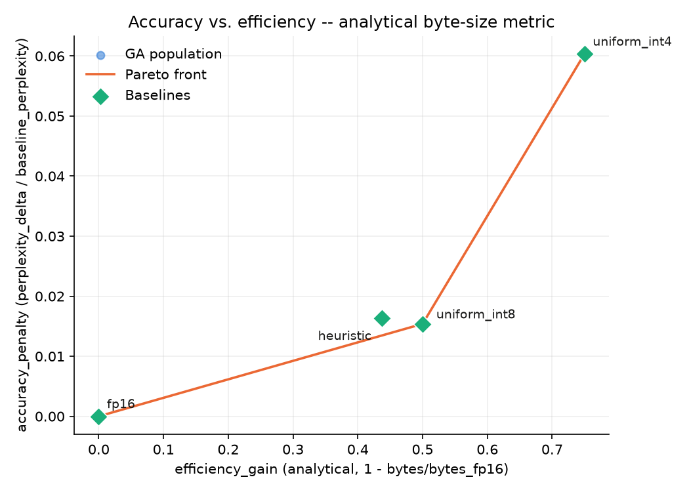
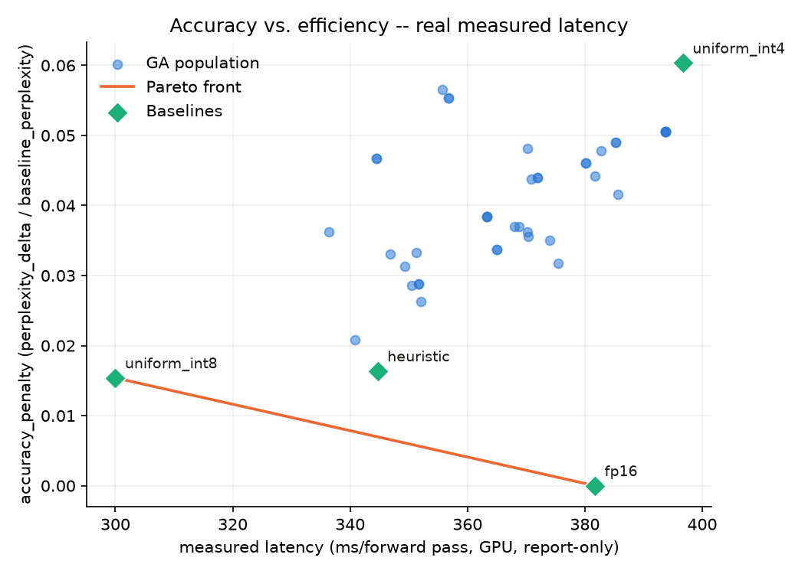

# Evol_inference

**Evolutionary search for mixed-precision LLM quantization** - applying population-based
combinatorial optimization to a modern LLM inference efficiency problem, directly
continuous with the asynchronous parallel steady-state genetic algorithm and dynamic
load balancing work from my dissertation.

Most quantization repos apply a known recipe (uniform INT8, or a published
mixed-precision heuristic). This one treats the choice of per-layer precision as a
combinatorial search problem and lets a steady-state GA search it, rather than assuming
the heuristic is right. Full design rationale, including two rounds of external review
and the corrections that came out of them, is in [`Doc/requirements.md`](Doc/requirements.md);
the phase-by-phase build log is in [`Doc/implementation_plan.md`](Doc/implementation_plan.md).

## The approach

- **Model**: [Phi-3-mini-4k-instruct](https://huggingface.co/microsoft/Phi-3-mini-4k-instruct)
  (3.8B params), chosen because its FP16 weights (≈7.6GB) sit right at the edge of a
  10GB consumer GPU's budget - quantization isn't a nice-to-have here, it's what buys
  back headroom for real context length.
- **Genome**: 8 genes, one per super-block of 4 consecutive transformer layers
  (grouped from the model's 32 layers to keep the search space tractable -
  3<sup>8</sup> = 6,561 configurations, not 3<sup>32</sup>). Each gene is one of
  `{FP16, INT8, INT4}`, applied via real bitsandbytes kernels through module
  substitution - not simulated quantization, and not the standard "quantize the whole
  model once at load time" flow, since neither supports reconfiguring per layer on
  every GA evaluation.
- **Fitness**: `efficiency_gain × w1 − accuracy_penalty × w2`, where both terms are
  fractions of a fixed FP16 baseline (not a percentile rank within the population - an
  earlier draft had that bug, and a steady-state design can't tolerate it: a
  population-relative fitness silently invalidates every cached score the moment the
  population changes). `accuracy_penalty` is WikiText-2 perplexity delta on a fixed
  2048-token slice; `efficiency_gain` defaults to the analytical byte-size reduction
  from the genome's bit-widths, or can be switched to real measured latency instead
  (`efficiency_metric="latency"` - see "Beyond bytes" below for why that matters).
- **Search**: an asynchronous, parallel, steady-state GA - no generations, no
  synchronization barrier. One fixed-capacity population (40 individuals) that workers
  continuously pull parents from (linear rank-weighted selection) and insert children
  into (crossover + mutation), evicting the current worst on overflow. Elitism falls
  out of that eviction rule rather than needing a special case.

## Hardware

Every result below - baselines, search, validation, and especially the measured-latency
numbers - was produced on a single machine:

| Component | Spec |
|-----------|------|
| CPU | 11th Gen Intel Core i7-11700K @ 3.60GHz |
| Memory | 64GiB (4×16GiB DDR4, 2667 MHz) |
| Disk | 1TB NVMe + 2TB SSD |
| GPU | NVIDIA GeForce RTX 3080, 10GB VRAM |
| PCIe | 4.0 over a x16 lane width (16GT/s) |

The 10GB VRAM budget is why Phi-3-mini-4k-instruct was chosen in the first place (see
"The approach" above), and the measured-latency finding below is specific to this
GPU's bitsandbytes kernel performance at batch size 1 - it isn't a universal claim
about INT4 vs. FP16 speed.

## Results

Four baselines (§7) and the GA's best-found configuration, scored on the same
fitness-loop signal. This reflects three independent, fully-converged searches
(different random seeds, ~650 evaluations each, ~10 minutes each apiece) - not the
first, shorter run: an early version of the stopping criterion let random
population-seeding noise burn through the stagnation budget before the GA had run a
single real step, understating what the search could actually do. See "What it took to
get a real answer" below.

| config                               | fitness    | accuracy_penalty | efficiency_gain | perplexity | size (GB) | latency (ms/fwd) |
|--------------------------------------|------------|------------------|-----------------|------------|-----------|------------------|
| FP16                                 | 0.0000     | 0.0000           | 0.0000          | 4.3708     | 6.750     | 383.9            |
| uniform INT8                         | 0.2423     | 0.0154           | 0.5000          | 4.4381     | 3.375     | 309.1            |
| heuristic (aggressive middle layers) | 0.2106     | 0.0164           | 0.4375          | 4.4424     | 3.797     | 346.3            |
| uniform INT4                         | 0.3448     | 0.0604           | 0.7500          | 4.6346     | 1.688     | 397.0            |
| **GA best** (3/3 seeds agree)        | **0.3448** | 0.0604           | 0.7500          | 4.6346     | 1.688     | 397.0            |

**The GA converges on uniform INT4 itself, exactly.** All three seeded runs (645, 650,
and 642 evaluations respectively) landed on the identical fitness and the identical
genome - `[INT4, INT4, INT4, INT4, INT4, INT4, INT4, INT4]` - and by the end of each
run the entire 40-individual population had collapsed to that one genome, with zero
diversity left. That's a real, if less dramatic, answer to the question the project set
out to ask: **within this 8-super-block search space, at this fitness weighting,
uniform INT4 is not just a strong baseline - it's the optimum**, and the GA reliably
finds it rather than beating it. The heuristic baseline ("quantize the middle layers
more aggressively"), which §7 frames as what the GA needs to beat, doesn't come close
either - keeping any super-blocks at full FP16 costs more in efficiency than the INT4
blocks save, so it's dominated by plain uniform INT8:



The second plot is the more important one, and the result is less flattering to
the analytical proxy:



**Real measured wall-clock latency does not track the analytical byte-size metric.**
FP16 and uniform INT8 dominate the *measured-latency* Pareto front; uniform INT4 -
the smallest configuration by far - is actually the **slowest** in real forward-pass
latency. This is a known characteristic of bitsandbytes' 4-bit dequantize-and-matmul
path at small batch sizes: the per-block dequantization overhead can outweigh the
memory-bandwidth savings that make INT4 a win at larger scale. The GA optimized
correctly against the metric it was given; that metric just isn't the whole story for
real deployment latency on this hardware. Both plots are generated from the same run
data - see `scripts/phase7_report.py`.

**Validation across three independent datasets** (WikiText-2, C4, Lambada - Phase 7,
run once on baselines + the GA's final population, not on every individual the search
touched) confirms the fitness-loop signal generalizes: the same accuracy ordering
(FP16 < uniform INT8 < heuristic < uniform INT4) holds on all three datasets, not just
the one the search optimized against.

| config       | WikiText-2 | C4     | Lambada |
|--------------|------------|--------|---------|
| FP16         | 4.3708     | 9.3108 | 15.0458 |
| uniform INT8 | 4.4381     | 9.4063 | 15.2645 |
| heuristic    | 4.4424     | 9.4966 | 15.3303 |
| uniform INT4 | 4.6346     | 9.7555 | 15.9620 |

## Beyond bytes: a latency-based objective finds a real mixed-precision win

The result above answers "what minimizes model size at this accuracy cost" -
`efficiency_gain` there is the analytical byte-size reduction. But the project's actual
goal is inference *speed*, and the measured-latency plot already shows bytes and real
latency disagreeing: on this GPU at batch size 1, uniform INT4 is the smallest
configuration and also the *slowest*. Optimizing bytes was optimizing a proxy that
points the wrong way for this hardware.

`FitnessEvaluator` now supports `efficiency_metric="latency"`:
`efficiency_gain = 1 − latency_ms / baseline_latency_ms` against the fixed FP16
baseline, using the same median-of-5-runs, warmup-then-time approach as the report-only
latency numbers above. Caveat that comes with it: latency is the one fitness input that
isn't a pure function of the genome, and the number describes one workload shape - a
single batch-1, 2048-token forward pass (prefill-style) - on this specific GPU. It is
not a universal INT4-vs-FP16 claim; a decode-style (one-token-at-a-time, KV-cached)
workload or a larger batch size could rank precisions differently.

Rerunning the original 50/50 weighting with latency as the efficiency term reranks the
baselines completely:

| config       | efficiency_gain (latency) | accuracy_penalty | fitness |
|--------------|---------------------------|-------------------|---------|
| FP16         | ≈0.000 (jitter)           | 0.0000            | ≈0.000  |
| **uniform INT8** | **+0.222** (22% faster than FP16) | 0.0154 | **0.1033** |
| heuristic    | +0.102                    | 0.0164            | 0.0427  |
| uniform INT4 | **−0.045** (4.5% *slower* than FP16) | 0.0604 | −0.0528 |

Uniform INT4 is now dominated on *both* axes - slower and less accurate than INT8 - so
no optimizer picks it under this objective. The GA (w1=w2=0.5, same settings as before)
converges to an exact tie with uniform INT8, same as the bytes-mode result just with a
different winner: efficiency still outweighs accuracy roughly 14:1 at the margin, so a
uniform config still wins.

### The w2 sweep: where a mixed genome actually wins

Shifting weight toward accuracy (fixed seed=0, ~600-700 evaluations per run, ~15-17 min
each) finds a real crossover point:

| w2 (w1) | GA best genome | fitness | vs. best baseline |
|---------|-----------------|---------|--------------------|
| 0.5 (0.5) | `[INT8]×8` | 0.1033 | tie |
| 0.6 (0.4) | `[INT8]×8` | 0.0775 | tie |
| 0.7 (0.3) | `[INT8]×8` | 0.0538 | tie |
| **0.8 (0.2)** | **`[FP16, INT8×7]`** | 0.0337 | **+0.0135** |
| 0.9 (0.1) | `[FP16, INT8×6, FP16]` | 0.0110 | +0.0028 |
| 0.95 (0.05) | `[FP16, INT8×6, FP16]` | 0.0060 | +0.0064 |

The transition is a sharp step, not a gradual slide: uniform INT8 holds through w2=0.7,
then a mixed genome takes over at w2=0.8 and stays optimal through 0.95 (0.9 and 0.95
land on the *identical* genome - a real plateau, not coincidence).

**The interesting part is which blocks get protected.** In every mixed genome the GA
found, it's the boundary super-blocks - the one closest to the embeddings, then also the
one closest to the output head as accuracy weight increases further - that stay at
FP16, while the six interior super-blocks go INT8. That is the *opposite* of the
heuristic baseline's assumption ("quantize the middle layers more aggressively," §7),
which is consistent with the heuristic baseline losing to every other config in every
run this project has produced. The GA wasn't told this pattern; it found it, independently,
by search - which is the actual point of treating this as a combinatorial optimization
problem instead of applying a known recipe.

One honest limitation: unlike the bytes-mode result (cross-validated with 3 seeds), the
sweep above is single-seed (seed=0) per weight. The step-function shape and the
consistent edge-protection pattern across 3 independent weightings (0.8, 0.9, 0.95) are
reassuring, but a second seed at w2=0.8 would be worth running before treating the exact
transition point as precise.

## What it took to get a real answer

The first search run stopped after 46 evaluations - only 6 of them real steady-state
steps - because the stopping criterion counted stagnation *during the 40-genome random
seeding phase*, before the GA had done anything. Population capacity (40) exceeding the
stagnation limit (30) meant ordinary seeding noise exhausted the patience budget on its
own. Fixed by only tracking stagnation once real selection/crossover/mutation begins
(`evol_inference/search.py`).

With that fixed, a single run reached fitness 0.3349 - close to uniform INT4 (0.3448)
but not quite there, and it ran only 126 evaluations before giving up: still not enough
patience for a 6,561-genome space. Raising `stagnation_limit` to 500 and dropping
per-evaluation latency measurement (report-only, never feeds fitness - see §5/§6; a
real measurement is backfilled once for the final population and baselines only,
`fitness.backfill_latency`) let each full search finish in ~10 minutes instead of the
multi-hour budget originally set aside. Three independent seeds at those settings all
converged to the exact same genome and fitness, which is what's reported above.

## Running it

```bash
python3 -m venv .venv && .venv/bin/pip install -r requirements.txt
.venv/bin/hf download microsoft/Phi-3-mini-4k-instruct --local-dir ./models/phi-3-mini-4k-instruct

PYTHONPATH=. .venv/bin/python -m pytest tests/                    # 57 tests

PYTHONPATH=. .venv/bin/python scripts/phase5_baselines.py         # baselines table
PYTHONPATH=. .venv/bin/python scripts/phase6_run_search.py \
    --capacity 40 --max-evaluations 5000 --stagnation-limit 500   # bytes-metric search
PYTHONPATH=. .venv/bin/python scripts/phase7_report.py            # validation + plots

# latency-based objective (§5 amendment) -- e.g. the w2=0.8 sweep point above:
PYTHONPATH=. .venv/bin/python scripts/phase6_run_search.py \
    --efficiency-metric latency --w1 0.2 --w2 0.8 \
    --capacity 40 --max-evaluations 5000 --stagnation-limit 500 \
    --final-path ./results/phase6_final_latency_w2_0.8.json
```

`scripts/phase6_run_search.py --help` lists every tunable (mutation rate, selection
pressure, crossover points, seed, `--efficiency-metric {bytes,latency}`, `--w1`/`--w2`,
whether to measure latency during the search itself).

## Layout

- `evol_inference/` - the library: `weight_bank.py` (per-layer quantized weight bank +
  genome assembly), `fitness.py` (accuracy/efficiency scoring + caching), `ga.py`
  (steady-state population, selection, crossover, mutation), `search.py` (the
  evaluation-budget / stagnation stopping criterion), `baselines.py`, `pareto.py`,
  `validation.py`.
- `scripts/` - one runnable entry point per build phase.
- `tests/` - pytest suite; logic that doesn't touch the model (selection math,
  crossover, Pareto fronts, the stopping criterion) is tested without a GPU dependency.
- `Doc/` - requirements, implementation plan, and the review history that shaped both.
